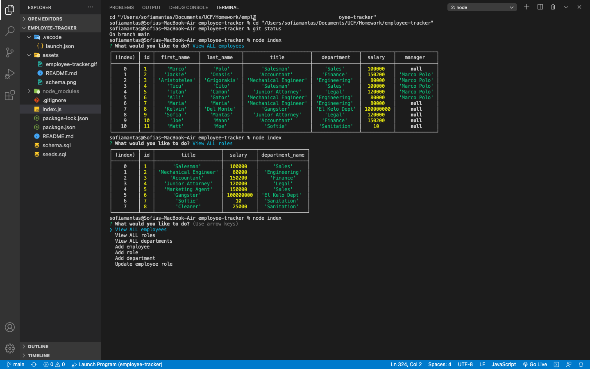

# EMPLOYEE-TRACKER

This Node application allows the user to view and manage departments, roles, and employees. 
The user can select the following options to change, add, or update:

* View all employees and their department, role, manager, and salary.
* Add a new employee, a new role, or a new department.
*Update the employee role and department. 

## Small example of functional application

# WATCH THE FOLLOWING VIDEO FOR FULL OPERATION 

https://youtu.be/bLeRgEL_hd4 

## LINK TO GITHUB REPO

https://github.com/Sofoula23/employee-tracker.git
